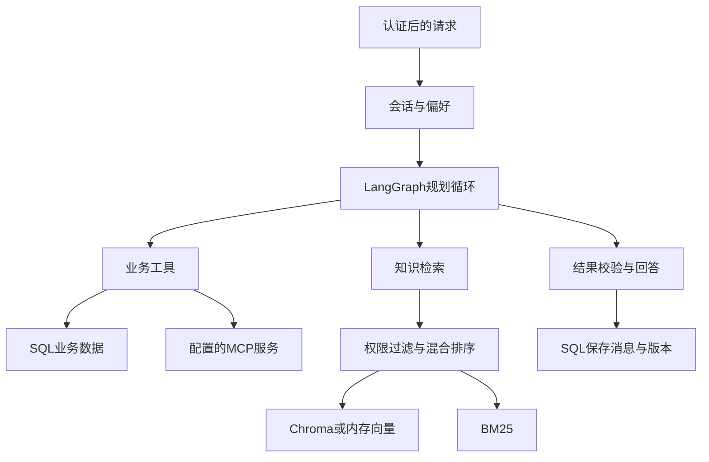

# 当前架构

FastAPI是单一入口，Services启动时初始化SQL、可选Redis、嵌入器、检索快照、工具路由和LangGraph。API从Bearer token映射用户，再校验会话归属。SQL是消息、偏好、业务记录和知识块的权威来源。

Redis保存会话快照，TTL为3天；每次命中仍查SQL归属与版本。Chroma只存知识块向量投影，不负责菜品库存或教室实时状态。BM25在进程内执行；没有另建搜索数据库。

LangGraph流程为prepare → plan → execute → plan循环 → respond。prepare处理日期、历史槽位、偏好、命中技能；demo用规则生成工具调用，配置模型后调用vLLM。每轮最多4次工具调用、默认最多4轮，图递归限制30。

教室/课程/菜品需要明确日期，缺日期追问；模型产生的日期不能覆盖用户已确认日期。业务回答由工具行确定性渲染（远端MCP目前只校验基本结构）；知识回答可以由模型生成，仍需另外评估依据忠实性。结果保存成功后失效Redis缓存。

单会话进程内asyncio锁配合SQL版本比较；当前启动器仅1个worker。扩大worker/副本前需要跨进程并发策略，不能仅调整uvicorn workers。偏好更新在图执行前单独提交，模型失败时偏好可能已更新。

语音和图表是同一认证入口的附加接口：ASR转文字后客户端再调用chat；TTS与图表通过已存储、属于当前用户的assistant message_id生成，避免任意调用访问别人的内容。

源码入口：[main](../backend/app/main.py)、[bootstrap](../backend/app/bootstrap.py)、[graph](../backend/app/agent/graph.py)。
